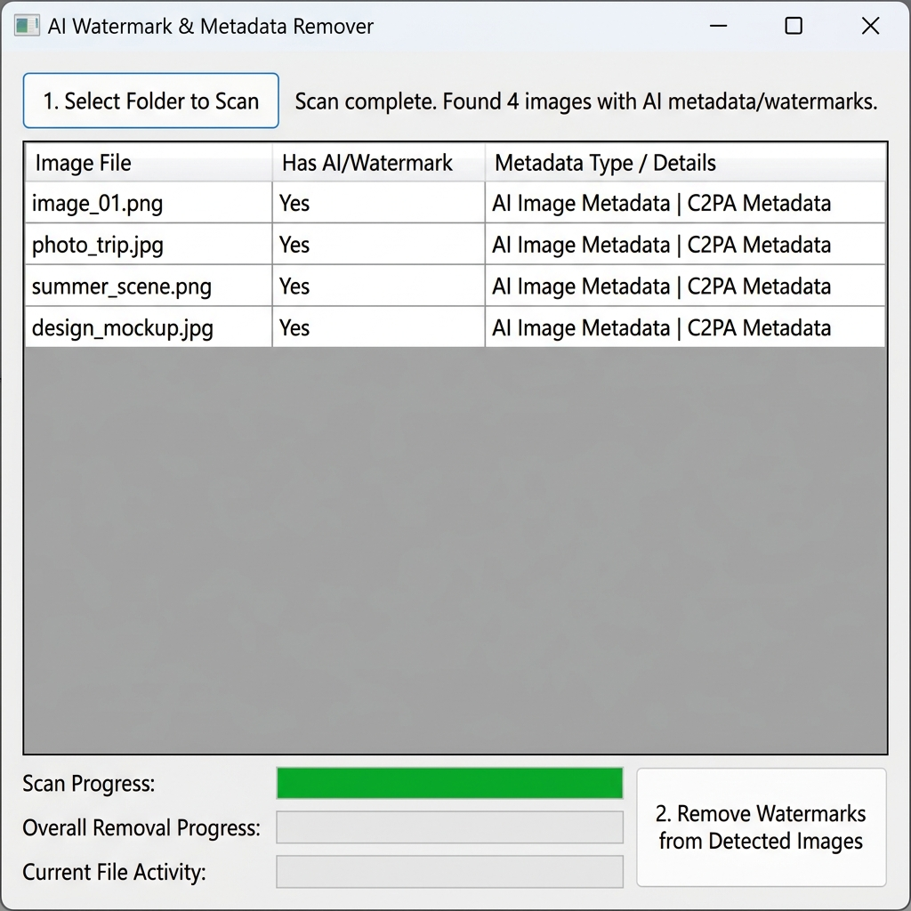

# 🎨 AI Watermark & Metadata Remover (GUI)

This GUI application is a visual, user-friendly wrapper built on top of the incredible [noai-watermark](https://github.com/mertizci/noai-watermark) library. 

**What does this GUI do?** 
Instead of forcing you to use complex command-line scripts to clean your images, this tool provides a simple, native Windows interface. It allows you to:
1. Select a folder of images with a single click.
2. Automatically scan and detect which images contain hidden AI watermarks or invisible C2PA metadata tracking.
3. Visually preview the specific metadata found in each image.
4. Clean the entire folder using advanced GPU-accelerated diffusion model regeneration, fully stripping all AI fingerprints while preserving image quality.



## 🌟 Acknowledgements & A Touch of Irony

First and foremost, massive praise goes to **[mertizci](https://github.com/mertizci)**, the original creator of the underlying `noai-watermark` library. This project operates entirely as a frontend dependent on their library. The heavy lifting—the diffusion model regeneration attacks, the CUDA optimizations, and the metadata stripping—is all thanks to their brilliant work!

**The Irony:** It is not lost on us that this GUI was built through a pair-programming session between a human developer and an AI assistant. Together, an AI and a human collaborated to build a tool designed specifically to remove AI watermarks! A beautiful paradox. 🤖🤝👨‍💻

## 💻 Prerequisites

Before running this application, your system must have:
* **Windows 10/11**
* **Python 3.10 or higher**: You can download this from [python.org](https://www.python.org/downloads/). 
  > **CRITICAL:** When installing Python, you **must** check the box that says "Add Python to PATH" on the very first installation screen.

## 🚀 Installation & Usage

We have included a "Smart Launcher" script (`launcher.bat`) that automatically handles all of the installation and virtual environment setup for you!

### 1. Download the Project
```powershell
# Clone this repository (to your preferred location)
git clone https://github.com/joseRey/noai-watermark-pyGUI.git
cd noai-watermark-pyGUI
```

### 2. Launch the Application
Just double-click the **`launcher.bat`** file in the main folder!

* **On the First Run:** The script will automatically create a secure Python virtual environment and download all the required libraries and heavy AI models (~4 GB). A terminal window will stay open for a few minutes while it downloads.
* **On Future Runs:** The script will instantly launch the GUI without any terminals popping up!

### 3. How to Use

1. Click **"1. Select Folder to Scan"** and choose a directory containing your images.
2. The application will scan the folder and display a table of all images containing AI metadata or hidden watermarks.
3. Click **"2. Remove Watermarks from Detected Images"**.
4. Grab a coffee! The application will initialize GPU acceleration, and visually update the progress table as each image is stripped and cleaned.

*Note: The cleaned images will overwrite the original files to ensure your workflow remains clutter-free.*
